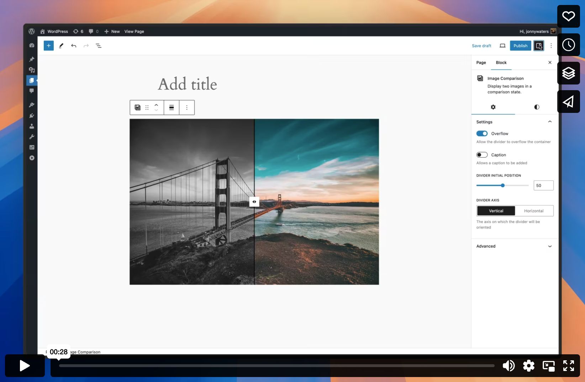

# Image Comparison

Draggable slider component that can be used to compare the difference between two images.

## Overview

Image Comparison provides a versatile draggable slider component that allows users to compare two images side-by-side. Ideal for showcasing before-and-after scenarios, Image Comparison enables easy visual comparisons through an interactive slider that can be customised to fit your theme.


## Demo

[](https://vimeo.com/1000389315)

## Documentation

### Installing
When installing to your site, add the following to your `composer.json` file. This will ensure that installation will use the built version of the package, and allow it to be loaded using Composer in the preferred path.

```json
{
  "repositories": [
    {
      "type": "vcs",
      "url": "git@github.com:bigbite/image-comparison.git"
    }
  ],
  "require": {
    "bigbite/image-comparison": "dev-main-built"
  },
  "extra": {
    "installer-paths": {
      "plugins/{$name}/": [
        "type:wordpress-plugin"
      ]
    }
  }
}

```

### Local Development or Manual Install
Clone the repository into your `plugins` or `client-mu-plugins` directory.
```
git clone git@github.com:bigbite/image-comparison.git && cd image-comparison
```

Install JS packages.
```
npm install
```

Build all assets
```
npm run build:dev
```

Install PHP packages and create autoloader for the plugin.
```
composer update
```

## Requirements

Image Comparison requires these software with the following versions:
- [WordPress](https://wordpress.org/) 6.3+
- [PHP](https://php.net/) 8.0

## Issues

 We welcome bug reports, feature requests, questions, and pull requests. If you spot any mistakes or have an idea to make the plugin better, just [open an issue](https://github.com/bigbite/image-comparison/issues/new/choose).

## Contributing

Please read [Code of Conduct](./CODE_OF_CONDUCT.md) for details on our code of conduct and [Contributing](./CONTRIBUTING.md) for details on the process for submitting pull requests to us.