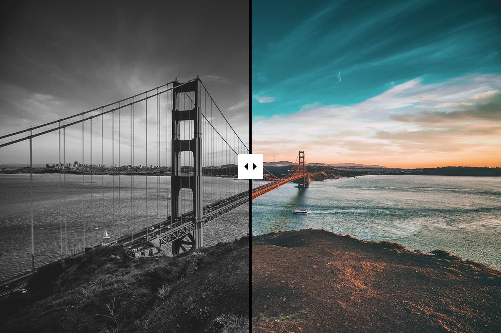

# Image Comparison

Draggable slider component that can be used to compare the difference between two images.

## Overview

Image Comparison provides a versatile draggable slider component that allows users to compare two images side-by-side. Ideal for showcasing before-and-after scenarios, Image Comparison enables easy visual comparisons through an interactive slider that can be customised to fit your theme.

## Demo

https://github.com/user-attachments/assets/8832e181-5a65-4aed-82d0-3b64a076f774

## Documentation

### Installing

### Local Development or Manual Install

## Requirements

Image Comparison requires these software with the following versions:
- [WordPress](https://wordpress.org/) 6.3+
- [PHP](https://php.net/) 8.0

## Issues

 We welcome bug reports, feature requests, questions, and pull requests. If you spot any mistakes or have an idea to make the plugin better, just [open an issue](https://github.com/bigbite/image-comparison/issues/new/choose).

## Contributing

Please read [Code of Conduct](./CODE_OF_CONDUCT.md) for details on our code of conduct and [Contributing](./CONTRIBUTING.md) for details on the process for submitting pull requests to us.
